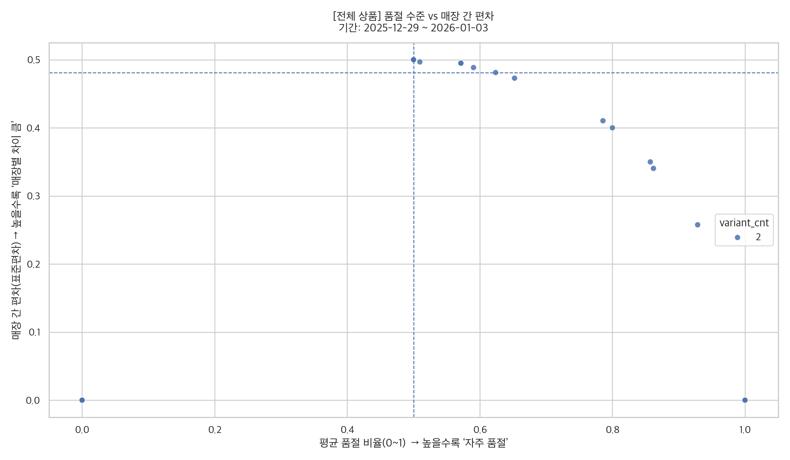

재고 품절(OOS) 데이터 기반 상품·매장 운영 이슈 분석 포트폴리오

---

## 📌 프로젝트 개요

리테일 운영 환경에서 상품이 **안 팔리는 이유**는 단순하지 않습니다.  
실제로는  
- 수요가 없어서 안 팔리는 경우도 있고  
- 재고 부족(품절) 때문에 팔리지 못하는 경우도 존재합니다.

본 프로젝트는 **재고 품절(Out-of-Stock, OOS) 데이터**를 기반으로  
> “이 상품이 안 팔리는 이유가 수요 부족인지, 재고/운영 문제인지”  
를 **데이터로 구분**하고,  
운영 관점에서 바로 활용 가능한 분석 결과를 도출하는 것을 목표로 합니다.

---

## ⭐ STAR 기반 프로젝트 설명

### 상황

리테일 매장 운영 경험 및 데이터 분석 관점에서,  
다음과 같은 문제를 발견했습니다.

- 동일한 상품임에도 매장별 판매 성과가 크게 다름
- 단순 매출/판매량만으로는  
  → **수요 문제인지, 재고 부족 문제인지 구분 불가**
- 운영 실무에서는 “어떤 상품부터 조치해야 하는지” 판단 기준이 부족

👉 **품절(OOS) 데이터를 활용한 구조적인 진단 프레임워크**가 필요하다고 판단했습니다.

---

### 과제

다음 목표를 설정했습니다.

- 전체 상품을 **동일한 기준**에서 비교 가능한 분석 구조 설계
- 품절을 단일 수치가 아닌 **패턴 관점**에서 해석
- 상품 문제 / 매장 운영 문제를 **의사결정 관점에서 분리**
- 분석 결과를 **PPT·리포트로 바로 활용 가능한 형태**로 정리

---

### 행동

#### 1️⃣ 데이터 수집·적재 파이프라인 구축
- **Python + Requests / Playwright**를 활용해 상품·매장 재고 데이터 수집
- Uniqlo API / 페이지 JSON 구조 변화에 대응하기 위해 **DFS 기반 파싱 로직** 구현
- MySQL 기반 스키마 설계 및 로그 적재
  - 상품 × 매장 × 변형(l2) × 일자 단위 재고 상태 기록

#### 2️⃣ 핵심 품절 지표 정의
- 평균 품절 비율 (Mean OOS Rate)
- 매장 간 품절 편차 (Standard Deviation)
- 하루 종일 품절 여부 (`oos_rate == 1`)
- 연속 ‘하루종일 품절’ 기간(Persistence)

#### 3️⃣ 전체 상품 패턴 조망 (Scatter Analysis)
- **산점도 분석**
  - X축: 평균 품절 비율
  - Y축: 매장 간 편차
- 모든 상품을 동일 기준으로 시각화하여 **품절 유형 분류 가능**하게 설계

#### 4️⃣ 의사결정 중심 사분면 분류
- **Q1**: 자주 품절 + 매장별 편차 큼  
  → 배분/운영 이슈 가능성
- **Q4**: 자주 품절 + 매장별 편차 작음  
  → 구조적 공급 부족 가능성
  

#### 5️⃣ 원인 구체화를 위한 히트맵 분석
- 대표 상품을 선정해 **매장 × 사이즈 단위 품절 히트맵** 시각화
- 특정 매장 집중 문제 vs 전사 공통 문제를 직관적으로 확인

#### 6️⃣ 지속적 운영 리스크 탐지
- `oos_rate == 1` 기준으로  
  **연속 ‘하루종일 품절’ 상품**을 계산
- 단발성 이슈가 아닌 **지속된 운영 실패 상품**을 우선 조치 대상으로 도출

---

### 결과

- 단순 품절률이 아닌 **패턴 기반 품절 분석 프레임워크 구축**
- 상품을 다음과 같이 명확히 구분 가능
  - 배분/운영 개선 대상 상품
  - 구조적 공급 부족 상품
- 분석 결과를
  - 산점도
  - 히트맵
  - Top 문제 상품 차트  
  형태로 자동 생성하여 **PPT·보고서 바로 활용 가능**
- “분석 → 해석 → 운영 액션”으로 이어지는 구조를 명확히 제시

---

## 🛠️ 사용 기술 스택

- **Language**: Python
- **Data Processing**: Pandas, NumPy
- **Visualization**: Matplotlib, Seaborn
- **Crawling / Collection**: Requests, Playwright
- **Database**: MySQL
- **ETL & Analysis**: SQLAlchemy, Raw SQL
- **Version Control**: Git / GitHub

---

## 📊 산출물 예시

- 전체 상품 품절 패턴 산점도
- 사분면(Q1/Q4) 대표 상품 히트맵
- 연속 ‘하루종일 품절’ 상품 Top 리스트
- 분석 결과 요약 리포트(PPT 활용 가능)

---

## 🚀 확장 가능성

- 품절 기준 완화 (`oos_rate ≥ 0.8`)
- 문제 매장 수 기반 영향도 분석
- 실시간 OOS 모니터링 대시보드
- 매출/전환 데이터 결합 분석

---

## 한 줄 요약

> 재고 품절 데이터를 통해  
> **“안 팔리는 상품”의 원인을 수요 문제와 운영 문제로 구분하고,  
> 의사결정에 바로 쓰일 수 있는 분석 구조를 설계·구현한 프로젝트**
